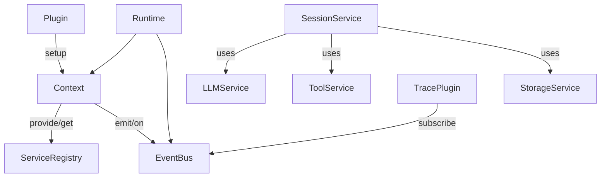

# 整体架构

状态：✅ v0.8 包结构已落地 · CLI 是 DX，不是 Web 产品

## 分层

```
                 ┌──────────────────────┐
                 │       Application    │
                 │  Coding / Research / │
                 │  Personal Agent ...  │
                 └──────────┬───────────┘
                            │
                     ┌──────▼──────┐
                     │ Agent Runtime│
                     └──────┬──────┘
                            │
       ┌────────────────────┼────────────────────┐
       │                    │                    │
   Agent/Session         Plugin System       Event Bus
       │                    │                    │
       └────────────────────┼────────────────────┘
                            │
              ┌─────────────┼─────────────┐
              ↓             ↓             ↓
             LLM           Tools        Storage
              │             │             │
          Providers       MCP/etc.    SQLite/...
```

| 层 | 职责 | 例子 |
| --- | --- | --- |
| Application | 产品形态、prompt、预设工具集 | Coding Agent、Research Agent |
| Agent Runtime | 生命周期、插件、服务、事件 | `Runtime` |
| Capabilities | 可替换能力实现 | LLM Provider、Tool Registry、SQLite |
| Adapters | 外部世界 | OpenAI API、MCP Server、文件系统 |

Application **不**直接 `new LLM()`；它只通过 Runtime 拿到 capability。

## 当前包结构

```
typescript-agent-harness/
├── packages/
│   ├── core/          ✅  Runtime / Plugin / Context / Service / EventBus
│   ├── agent/         ✅  Session / Loop / resume
│   ├── llm/           ✅  mock + OpenAI-compatible
│   ├── tools/         ✅  registry + list/read/write
│   ├── storage/       ✅  SQLite / Memory + checkpoint
│   ├── mcp/           ✅  MCP backend → Tool（ping + stdio）
│   ├── scheduler/     ✅  once / every
│   ├── permissions/   ✅  allow / deny
│   └── cli/           ✅  tah run / tah chat
└── examples/
    ├── basic-runtime/ ✅  Phase 1 冒烟
    ├── basic-agent/   ✅  Phase 2
    ├── resume-agent/  ✅  Phase 3
    └── multi-agent/   ✅  Phase 4
```

## 核心对象关系



要点：

- `Runtime` 持有唯一的 `EventBus` 与 `Context`
- 每个 `Plugin.setup(ctx)` 向 Context 注册服务或订阅事件
- `Session` / `LLM` / `Tools` 都是 Context 上的 service，不是 Runtime 的硬字段

## 一次 `session.run` 的数据流

```mermaid
sequenceDiagram
  participant App
  participant Session
  participant Loop
  participant LLM
  participant Tools
  participant Bus as EventBus
  participant Store as Storage

  App->>Session: run(input)
  Session->>Bus: session.turn.start
  Session->>Loop: run(ctx)
  Loop->>LLM: generate(messages, tools)
  LLM->>Bus: llm.request / llm.response
  alt has tool calls
    Loop->>Tools: execute(call)
    Tools->>Bus: tool.started / tool.finished
    Loop->>Store: append step + events
  else final answer
    Loop->>Store: checkpoint
    Session->>Bus: session.turn.end
  end
```

## 设计约束

1. **插件不互相 import 实现** — 只依赖 `ServiceKey` 与事件名  
2. **模型可见内容必须可从 Session 事件重建** — 禁止「只在内存里改过、日志里没有」  
3. **Loop 可替换** — Runtime 不内置唯一对话算法  
4. **持久化是一等公民** — Phase 3 起，resume 不是事后补丁  
5. **权限在能力边界** — 只读 Agent = 不注册写工具，而不是靠 prompt 劝说  

## 与 DeepSeek Harness 的关系

| DeepSeek Harness | typescript-agent-harness |
| --- | --- |
| Cordis 插件元框架 | 自研轻量 Plugin + Context（Phase 1） |
| Everything is a plugin | Everything is a capability（以 Plugin 挂载） |
| SessionEvent 日志 | Session + Event Log + Checkpoint（Phase 3） |
| 完整 Web / Desktop | 未做；Phase 5 只交付 CLI |

我们借鉴的是**架构思想**，不是 1:1 复刻 Cordis / dsh 产品面。
